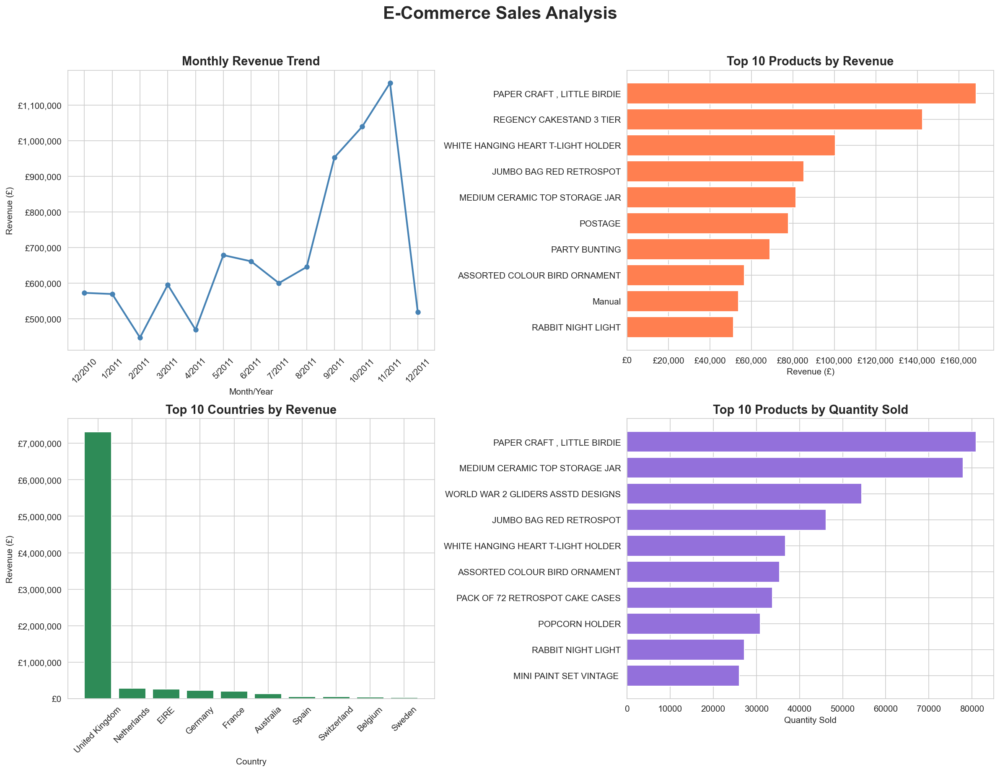

# E-Commerce Sales Analysis

## Overview
Analysis of 541,909 e-commerce transactions to identify revenue trends, 
top products, and regional performance.

## Tools Used
- Python, Pandas, Matplotlib, Seaborn

## Key Insights
- Total Revenue: £8.9 million
- Revenue peaked in Oct-Nov 2011 due to Christmas shopping season
- UK accounts for 82% of total revenue
- PAPER CRAFT LITTLE BIRDIE was top selling and highest revenue product

## Visualizations

## Dataset
UCI E-Commerce Dataset — 541,909 transactions from a UK online retailer